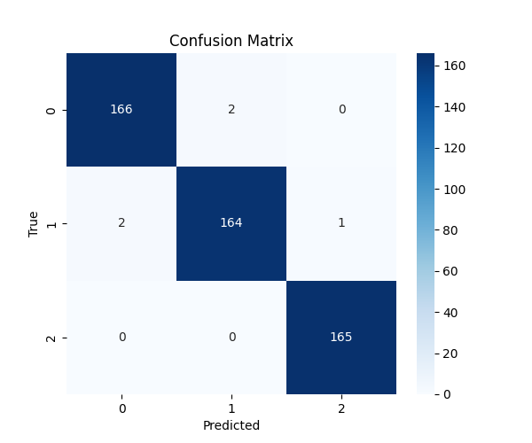

# Домашнее задание к уроку 2: Линейная и логистическая регрессия
## Задание 1: Модификация существующих моделей (30 баллов)
### 1.1 Расширение линейной регрессии (15 баллов)
```python
# Модифицируйте существующую линейную регрессию:
# - Добавьте L1 и L2 регуляризацию
# - Добавьте early stopping
```

файл с кодом `homework_model_modification_linger.py`

файл модели `linreg_torch_l1.pth`
```python
Вывод с L1 регуляризацией:
Размер датасета: 200
Количество батчей: 7
Epoch 10: loss=0.0683
Epoch 20: loss=0.0353
Epoch 30: loss=0.0297
Epoch 40: loss=0.0296
Epoch 50: loss=0.0300
Epoch 60: loss=0.0298
Epoch 70: loss=0.0300
Epoch 80: loss=0.0304
Epoch 90: loss=0.0294
Epoch 100: loss=0.0302
tensor([[1.9596]]) tensor([-0.9742])
```

файл модели `linreg_torch_l2.pth`
Вывод с L2 регуляризацией:
```python
Размер датасета: 200
Количество батчей: 7
Epoch 10: loss=0.0740
Epoch 20: loss=0.0474
Epoch 30: loss=0.0477
Epoch 40: loss=0.0491
Epoch 50: loss=0.0501
Epoch 60: loss=0.0508
Epoch 70: loss=0.0510
Epoch 80: loss=0.0515
Epoch 90: loss=0.0514
Epoch 100: loss=0.0517
tensor([[2.0307]]) tensor([-1.0038])
```

файл модели `linreg_torch_es.pth`
```python
Вывод с Early Stopping (ES):
Размер датасета: 200
Количество батчей: 7
Epoch 10: loss=0.0908
Epoch 20: loss=0.0474
Epoch 30: loss=0.0454
Epoch 40: loss=0.0491
Early stoppin на эпохе 40
tensor([[1.9284]]) tensor([-0.9473])
```

### 1.2 Расширение логистической регрессии (15 баллов)
```python
# Модифицируйте существующую логистическую регрессию:
# - Добавьте поддержку многоклассовой классификации
# - Реализуйте метрики: precision, recall, F1-score, ROC-AUC
# - Добавьте визуализацию confusion matrix
```

файл с кодом `homework_model_modification_logreg.py`
Вывод:
```python
Размер датасета: 500
Количество батчей: 16
Epoch 10: loss=0.2669, acc=19.3125
Epoch 20: loss=0.2162, acc=19.5625
Epoch 30: loss=0.1788, acc=19.8750
Epoch 40: loss=0.1656, acc=20.1250
Epoch 50: loss=0.1465, acc=20.3750
Epoch 60: loss=0.1365, acc=20.4375
Epoch 70: loss=0.1297, acc=20.6250
Epoch 80: loss=0.1252, acc=20.6250
Epoch 90: loss=0.1220, acc=20.6875
Epoch 100: loss=0.1189, acc=20.6875
```

```python
Classification report:
              precision    recall  f1-score   support

           0       0.99      0.99      0.99       168
           1       0.99      0.98      0.98       167
           2       0.99      1.00      1.00       165

    accuracy                           0.99       500
   macro avg       0.99      0.99      0.99       500
weighted avg       0.99      0.99      0.99       500
```

```python
ROC-AUC score: 0.9922
```



## Задание 2: Работа с датасетами (30 баллов)

### 2.1 Кастомный Dataset класс (15 баллов)
```python
# Создайте кастомный класс датасета для работы с CSV файлами:
# - Загрузка данных из файла
# - Предобработка (нормализация, кодирование категорий)
# - Поддержка различных форматов данных (категориальные, числовые, бинарные и т.д.)
```

файл с кодом `homework_datasets.py`

### 2.2 Эксперименты с различными датасетами (15 баллов)
```python
# Найдите csv датасеты для регрессии и бинарной классификации и, применяя наработки из предыдущей части задания, обучите линейную и логистическую регрессию
```

```python
X: torch.Size([128, 23])
y: torch.Size([128, 1])
NaN в X: tensor(False)
NaN в y: tensor(False)
Epoch 10: loss=nan
Epoch 20: loss=nan
Epoch 30: loss=nan
Epoch 40: loss=nan
Epoch 50: loss=nan
Epoch 60: loss=nan
Epoch 70: loss=nan
Epoch 80: loss=nan
Epoch 90: loss=nan
Epoch 100: loss=nan
tensor([[nan, nan, nan, nan, nan, nan, nan, nan, nan, nan, nan, nan, nan, nan, nan, nan, nan, nan, nan, nan, nan, nan, nan]]) tensor([nan])
```
почему-то у меня всегда выводится nan, хотя я все признаки превратил в численные типы

датасет перед очисткой:
```python
Типы данных:
car_ID                int64
symboling             int64
CarName              object
fueltype             object
aspiration           object
doornumber           object
carbody              object
drivewheel           object
enginelocation       object
wheelbase           float64
carlength           float64
carwidth            float64
carheight           float64
curbweight            int64
enginetype           object
cylindernumber       object
enginesize            int64
fuelsystem           object
boreratio           float64
stroke              float64
compressionratio    float64
horsepower            int64
peakrpm               int64
citympg               int64
highwaympg            int64
price               float64
dtype: object
```

датасет после очистки:
```python
Типы данных:
symboling             int64
fueltype              int64
aspiration            int64
doornumber            int64
carbody               int64
drivewheel            int64
enginelocation        int64
wheelbase           float64
carlength           float64
carwidth            float64
carheight           float64
curbweight            int64
enginetype            int64
cylindernumber      float64
enginesize            int64
fuelsystem            int64
boreratio           float64
stroke              float64
compressionratio    float64
horsepower            int64
peakrpm               int64
citympg               int64
highwaympg            int64
price               float64
dtype: object
```